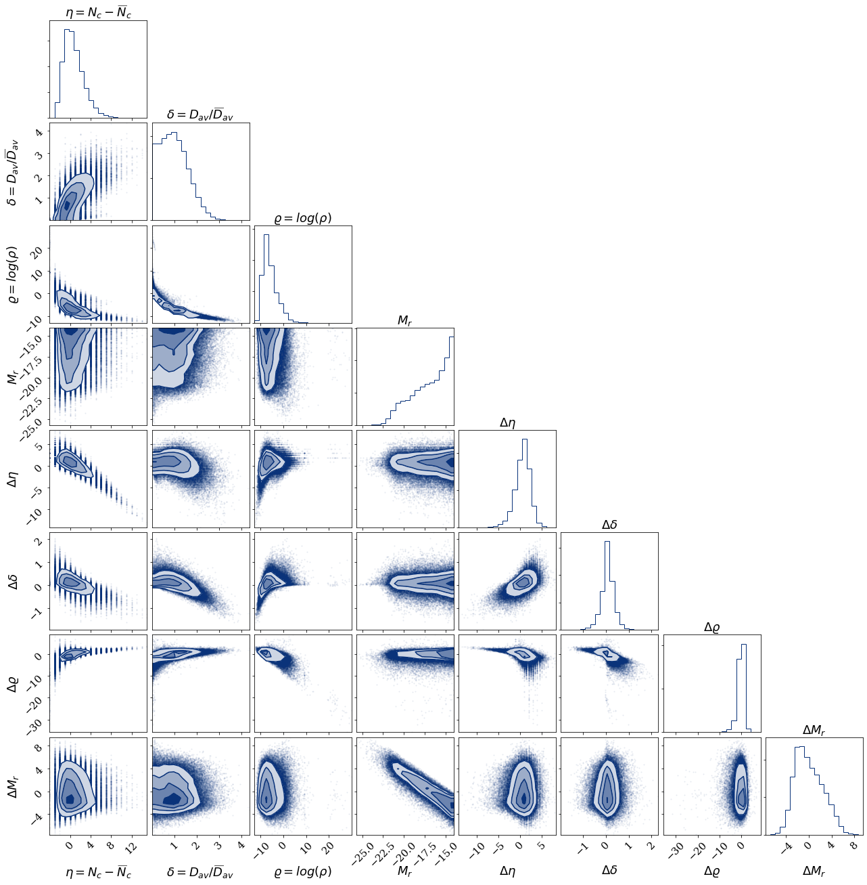
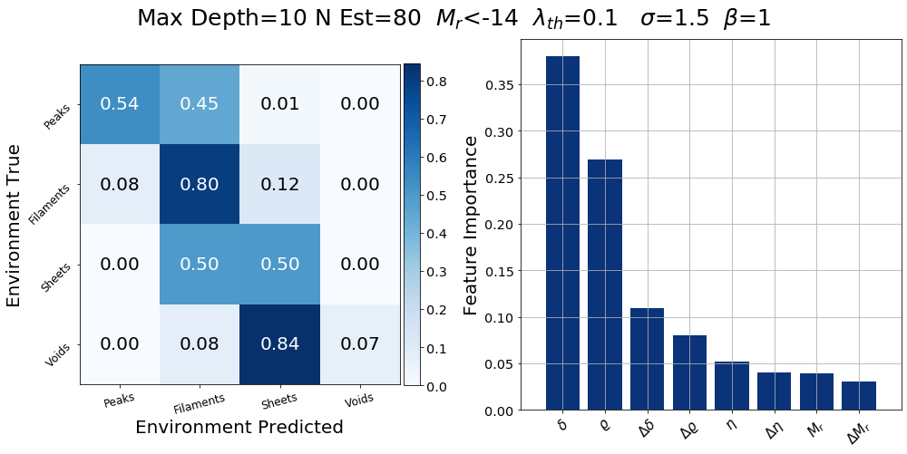

# Cosmic Web Classification from the beta-skeleton

The goal of this code is to reconstruct the cosmic web of Dark Matter (DM) using the galaxy's position and luminosity.

We use the <a hreft=https://github.com/flgomezc/HackingLSSCode>HackingLSSCode</a> code to compute the beta-skeleton (bsk) over a distribution of galaxies. Using 
the features extracted from the bsk jointly with the luminosity of the galaxies, we split the data in train(50%), test(30%) and valid(20%) sets to apply 
a Random Forest algorithm and classify the galaxies in the four environments of the cosmic web: peaks, filaments, sheets, or voids.

The <b>01_Compute_bsk.ipynb</b> notebook allows to compute the bsk and the features of the galaxies extracted from its. This notebook needs as input a hdf5 
file with the values of <i>(x,y,z)</i> positions and the magnitude of luminosity <i>Mr</i> of the galaxies. An example mock file are stored in 
<i>./data/example_mock.hdf5</i>. This notebook creates the <i>example_pos_mock.BSKIndex</i> file with that contains the bsk graph and the 
<i>example_features.h5</i> file with the features of the galaxies.

The <b>02_Features_Visualization</b> notebook allows to visually explore the correlations between the features.

The <b>03_Random_Forest</b> notebook split the data features in train(50%), test(30%) and valid(20%) to evaluate a Random Forest Model and compute the feature 
importances, the confusion matrix, and plot a visual comparison between the cosmic web predicted and the truth.

