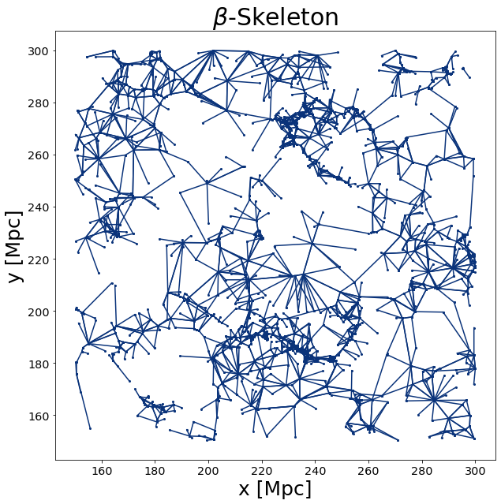
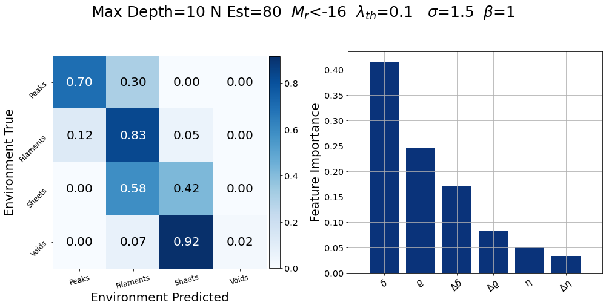

# Cosmic Web Classification from the beta-skeleton

The goal of this code is to reconstruct the cosmic web of Dark Matter (DM) using the galaxy's position and magnitude luminosity.

Using the <a hreft=https://github.com/flgomezc/HackingLSSCode>HackingLSSCode</a> code to compute the beta-skeleton (bsk) over a distribution of galaxies and using the features extracted from the bsk-graph jointly with the magnitude luminosity of the galaxies, this code evaluate the model, a Random Forest algorithm to classify the galaxies in the four enviroments of the DM cosmic web: peaks, filaments, sheets or voids.

The <b>01_Compute_bsk.ipynb</b> notebook allows to compute the bsk and the bsk-features of the galaxies. This notebook needs as input a hdf5 
file with the values of <i>(x,y,z)</i> positions and the magnitude of luminosity <i>mr</i> of the galaxies. An example mock file are stored in 
<i>./data/example_test_mock.hdf5</i>. This notebook creates the <i>example_pos_mock.BSKIndex</i> file that contains the bsk graph and the 
<i>example_features.hdf5</i> file with the bsk-features.

The <b>02_Features_Visualization.ipynb</b> notebook allows visually to explore the correlations between the bsk-features.

The <b>03_Model_Evaluation.ipynb</b> notebook evaluates our trained model computing the confusion matrix and the features importance. It is an example where we know the environment.

The <b>04_Model.ipynb</b> notebook run our trained model and compute the environments of a set of test galaxies. The script also plots the environments of the cosmic web founded.

